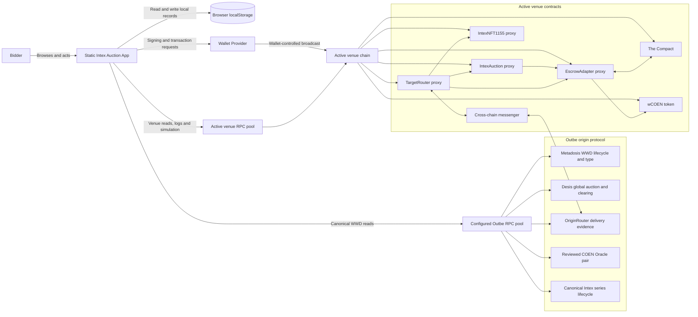
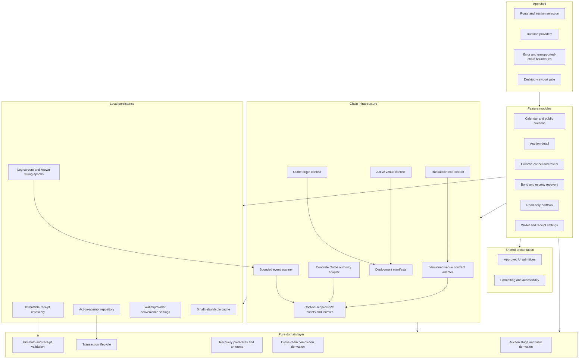
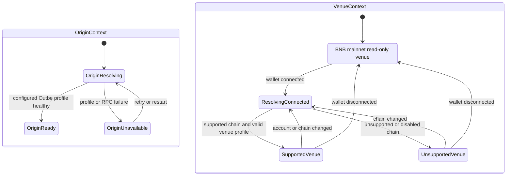
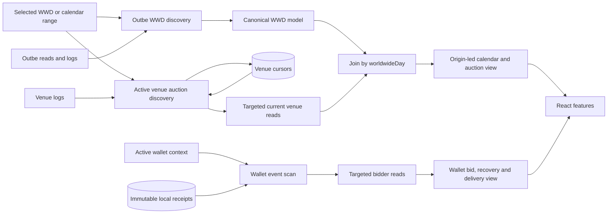
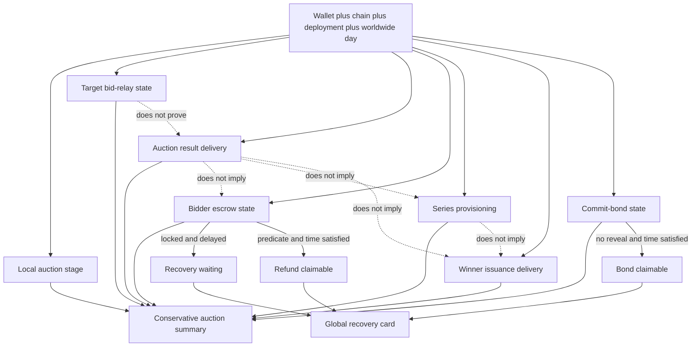
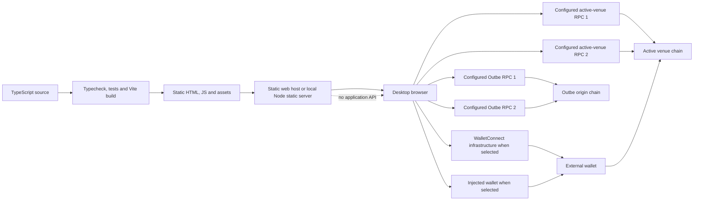

# Auction Application System Architecture

**Status:** Accepted
**Date:** 2026-08-02
**Scope:** Production bidder application  
**Related:** `AGENTS.md`, `current-production-contract-profile.md`

## 1. Purpose

This document defines the production system architecture for the Intex auction application. It translates the accepted product and contract decisions into an implementable frontend design while avoiding infrastructure that the first release does not require.

The selected design is a **modular static frontend monolith**:

- one React/TypeScript application;
- one persistent public Outbe origin context plus one active venue and wallet context;
- direct Outbe WWD reads plus active-venue RPC reads and logs;
- wallet-provider signing and transaction submission;
- typed contract adapters between features and Solidity contracts;
- browser-local persistence for critical reveal receipts, settings and bounded indexing metadata;
- event-derived candidates reconciled with targeted current-state reads;
- no backend, server database, hosted indexer or background worker service.

Contract state and logs remain authoritative. Local data is either critical user-created reveal material or a rebuildable convenience cache.

## 2. Architecture views

A single large diagram would mix navigation, browser modules, token custody, contract wiring, transaction sequencing and cross-chain delivery. The architecture is represented through complementary views instead.

| View | Question answered | Diagram type |
|---|---|---|
| System context | What systems and trust boundaries exist? | Context flowchart |
| Browser structure | How is the static application divided internally? | Component flowchart |
| Active context | What happens on wallet, account or chain changes? | State diagram |
| Read model | How are logs, reads and local records combined? | Data-flow diagram |
| Write flow | How do commit and reveal remain safe? | Sequence diagram |
| Completion model | Why is auction completion not one boolean? | Independent-state flowchart |
| Deployment | What is deployed and operated? | Deployment flowchart |

The diagrams describe architectural concerns, not an implementation class hierarchy.

## 3. Architecture decision

### 3.1 Modular frontend monolith

The first release uses one deployable frontend with explicit internal boundaries:

1. **App shell** — routing, providers, error boundaries and desktop viewport gate.
2. **Feature modules** — calendar, auction detail, bidding, recovery, portfolio and settings.
3. **Domain layer** — pure types, integer calculations and state derivation.
4. **Chain layer** — manifests, RPC transport, wallet access, contract adapters, event scanning and transaction coordination.
5. **Storage layer** — versioned local repositories for receipts, action attempts, settings, known wiring epochs and log cursors.
6. **Shared UI** — approved visual primitives, formatting and accessibility.

These are source-code boundaries inside one application bundle, not microfrontends.

### 3.2 Alternatives rejected for the first release

#### Backend API plus database

A backend would add deployment, authentication, synchronization, schema migration and operational ownership without an agreed server-owned capability.

#### Hosted blockchain indexer

The active-chain history can initially be reconstructed incrementally from deployment blocks, logs and targeted reads. An indexer is introduced only after measured RPC limitations justify it.

#### Full event-sourced browser database

IndexedDB projections, reducers and replay infrastructure are unnecessary before history volume and performance requirements are measured. The initial application needs immutable reveal receipts, small cursors and rebuildable summaries.

#### Direct contract calls from React components

Direct ABI calls from components would couple presentation to versions, wiring, fixed-point rules and contract errors. Contract interaction belongs behind typed adapter functions.

#### Generic clean-architecture framework

The application needs dependency direction and pure domain logic, but not a mandatory command bus, dependency-injection container or repository abstraction for every operation.

## 4. Design principles

### Contract-first and fail-closed

- Current reads and durable logs outrank cached presentation state.
- Writes are disabled when deployment profile or live wiring compatibility cannot be established.
- Unknown contract errors remain errors rather than optimistic local success.
- Fresh simulation is the final pre-submission eligibility check.

### Persistent origin and active venue contexts

The runtime has one sticky public Outbe context for canonical WorldwideDay and reviewed Oracle state and one active venue context. A connected wallet chain replaces the disconnected BNB-mainnet venue, but it does not replace the Outbe context. Account or chain changes invalidate venue-bound queries, prepared transactions and wallet views; origin WWD and chart data remain valid when the origin profile is unchanged. `WorldwideDayKey` uses the protocol UTC+14 calendar, while venue schedules remain UTC Unix timestamps.

### Local-first critical receipt safety

The exact reveal signature and typed value are stored and read back before commit submission. Receipt persistence is part of the commit workflow, not a later convenience.

### Immutable reveal material, mutable attempts

A reveal receipt is immutable and identified by its commit hash. Commit, cancellation and reveal transaction attempts are separate mutable records. Recommit must not overwrite an earlier receipt for the same bidder and worldwide day.

### Derived views, not duplicated truth

UI state is derived from:

- current contract reads;
- durable events;
- matching local receipts;
- confirmed transaction receipts;
- the active manifest and compatible wiring profile.

The application does not maintain a second authoritative auction state machine.

### Independent cross-chain outcomes

WWD processing, global Desis clearing, OriginRouter delivery, local reveal/relay, target result, bidder escrow finalization, canonical Intex lifecycle, target series provisioning and recipient delivery are independent dimensions. No aggregate status may imply more than its evidence proves.

## 5. System context



### Context implications

- The wallet is the signing boundary. Private keys never enter the application.
- The origin RPC pool, venue RPC pool and wallet provider are separate transports. Each logical operation stays on one sticky healthy endpoint for its context.
- Metadosis WWD lifecycle/day type, Desis global auction and chain participation, OriginRouter delivery, Oracle evidence and canonical Intex lifecycle always come from Outbe.
- Venue auction delivery, schedule, bids, escrow, target result, target NFT representation and balances come only from the active venue and join origin state by `worldwideDay` and `seriesId`.
- A missing venue auction is not a missing WWD. Origin and venue absence or failure are classified independently.
- `EscrowAdapter` is the approval spender, but bidder funds are deposited into and withdrawn from The Compact through the adapter.
- The application does not expose Compact actions. It only validates the escrow's live Compact and payment-token wiring where required for compatibility.
- Outbe WWD reads inform public context only. Commit, cancel, reveal and recovery eligibility remains governed by fresh active-venue contract state.

## 6. Browser application structure



### Dependency rule

Domain code does not import React, wallet libraries, RPC clients or browser storage. Features may directly compose a small number of domain and infrastructure functions. Do not add a mandatory use-case-class layer unless real duplication appears.

## 7. Minimal source structure

```text
config/                         runtime JSON values and reviewed ABI files
src/
  main.tsx                      production entry point
  auction/                    production application
    app/                        routing, providers, shell, error boundaries
    runtime-config/             config loading, validation and types
    domain/                     pure types, calculations and state derivation
    chain/                      origin/venue RPC, wallet, contracts, logs and transactions
    storage/                    receipts, attempts, settings, cursors and migrations
    features/                   calendar, auction, bidding, recovery and portfolio
    ui/                         approved shared visual primitives
```

Feature directories remain shallow until their file count justifies subdirectories. Do not require every feature to have identical `api`, `model`, `hooks`, `services` and `components` folders.

## 8. Active runtime contexts



### Context transition requirements

On account or wallet-chain change:

1. cancel or ignore in-flight venue requests from the prior context;
2. clear venue-derived views and pending transaction preparation;
3. resolve the new venue manifest and RPC set;
4. read current venue contract wiring;
5. load the new venue overlay for the already selected WWD or calendar range;
6. load only the new wallet's receipts, history, recovery and portfolio;
7. keep inactive-context records stored but absent from the active experience;
8. retain loaded Outbe WWD data when the origin profile is unchanged.

Every asynchronous result carries an origin or venue context key so a late response cannot populate the wrong context.

Suggested context identities:

```text
origin public:
originProfileId + metadosisAddress + worldwideDay-or-range

venue public:
chainId + deploymentProfileId + auctionProxy + worldwideDay-or-range

wallet-specific:
chainId + deploymentProfileId + auctionProxy + walletAddress
```

Deployment and proxy identity are required so a redeployment on the same chain cannot collide with earlier records.

## 9. Read model and reconciliation

The application joins canonical origin state to one active-venue overlay, then validates actionable venue state with current reads.



### Public auction path

- Generate typed UTC+14 WWD keys and read Metadosis lifecycle/day type/terminal disposition, Desis global stage and chain participation, and OriginRouter delivery evidence from Outbe. Keep Oracle UTC accounting dates and contract UTC timestamps as separate types.
- Read active-venue router, auction, escrow and log evidence separately for the same `worldwideDay` values.
- Compose the displayed calendar as `Metadosis WWD + Desis global/participation + OriginRouter delivery + active-venue overlay`.
- Distinguish invalid/missing WWD, failed Green, completed Red, terminal no-auction, globally active/cleared, venue included/skipped, origin send parked/flushed, cleaned history unavailable, pending venue delivery, delivered venue auction and scoped RPC failures.
- Show the canonical WWD date and local auction/schedule date distinctly. Before venue delivery, show schedule pending and do not derive a date from a fixed offset or `scheduledProcessTime`. A Red/no-auction state names its source WWD.
- During reveal, reconcile current venue `getAuctionDetails` data with venue `BidRevealed` events.
- For historical or reaped venue auctions, reconstruct the ladder from venue logs.
- Derive offered quantity only from successful Desis clearing plus transactionally matched unused-supply evidence; label Desis total demand as gross included demand. Never derive either, a strike percentage or bidder allocation from the local ladder.
- Read the approved COEN/VWAP chart from one reviewed Outbe Oracle pair and overlay venue Entry/Floor/Call reference lines when available. Oracle failure is an explicit chart state and does not alter WWD or venue eligibility.

### Historical revealed bids

`BidRevealed` does not carry the stored reveal timestamp, so historical reconstruction uses the event fields, the block timestamp as reveal time, and `logIndex` for in-block ordering, verified against the pinned `IntexAuction` sources and tests. The current array and event reconstruction are reconciled while both are available.

### Wallet history path

- Scan wallet-relevant event families from deployment blocks and known wiring epochs.
- Store resumable cursors per chain, profile, epoch and event family.
- Treat events as candidates, not final actionable state.
- Reconcile commitments, bonds, escrow, result and issuance candidates with current views.

### Target bid-relay path

The target router can prove local relay attempts and deferred retries, but target-only evidence does not prove that Outbe accepted a complete generation. Suggested states are:

```text
LocalRevealRecorded
RelayDeferred
RelaySentOriginAcceptanceUnconfirmed
AuctionResultReceived
```

Do not claim global participation solely from `BidRevealed`, `BidsDoneSent` or `BidsRelayFlushed`. Permissionless router retries remain status-only unless separately approved.

### Current portfolio path

Use NFT owner-enumeration and balance views. Do not replay all transfer history to calculate current balances.

### Polling policy

Begin with block-based HTTP polling and bounded `eth_getLogs` reconciliation. Add WebSocket subscriptions only after polling fails a measured freshness or RPC-load budget. Periodic reconciliation remains required even if subscriptions are later added.

### Cache policy

- Query results and derived models may be cached in memory.
- Small public/history summaries may be cached locally when useful.
- Every cache entry is versioned and namespaced.
- Cached data can be deleted and rebuilt without losing reveal capability.
- Critical reveal receipts are not cache.

## 10. Commit, cancel, recommit and reveal flow

```mermaid
sequenceDiagram
    actor Bidder
    participant UI as Bidding feature
    participant Domain as Bid domain
    participant Store as Local repositories
    participant Adapter as Venue contract adapter
    participant Wallet as Wallet provider
    participant Chain as Active venue chain

    Bidder->>UI: Enter quantity and contract bid rate
    UI->>Adapter: Read auction params, stage and live wiring
    Adapter-->>UI: Fresh compatible context
    UI->>Domain: Build typed value and calculate lock amount
    Domain-->>UI: Valid fields and nonzero uint128 lock amount

    UI->>Wallet: Request EIP-712 reveal signature
    Wallet-->>UI: Exact signature
    UI->>Domain: Validate signer, domain and commit hash
    Domain-->>UI: Immutable versioned receipt

    UI->>Store: Persist receipt keyed by commitHash
    Store-->>UI: Stored record
    UI->>Store: Read back and validate
    Store-->>UI: Verified durable record

    UI->>Adapter: Read commit allowance and simulate commit
    alt commit approval required
        Adapter->>Wallet: Request exact bond approval
        Wallet->>Chain: Submit approval
        Chain-->>Adapter: Approval confirmed
        Adapter->>Adapter: Re-read allowance
    end

    Adapter->>Wallet: Request commit transaction
    Wallet->>Chain: commitBid
    Chain-->>Adapter: Transaction receipt
    Adapter->>Store: Append commit attempt state
    Adapter-->>UI: Reconciled live commitment and bond

    opt bidder cancels during commit stage
        UI->>Adapter: Revalidate stage and live commitment
        Adapter->>Wallet: Request cancel transaction
        Wallet->>Chain: cancelCommit
        Chain-->>Adapter: Transaction receipt
        Adapter->>Store: Append cancellation attempt state
        Adapter-->>UI: Reconciled cancellation and bond release
    end

    Note over UI,Store: A recommit creates a new immutable receipt; earlier receipts are retained
    Note over UI,Store: Reveal is enabled only from the receipt matching the current on-chain commitHash

    Bidder->>UI: Reveal stored bid
    UI->>Store: Load receipt matching live commitHash
    Store-->>UI: Signature and typed value
    UI->>Adapter: Read stage, wiring, allowance, balance and live bond
    Adapter-->>UI: effectiveBalance = walletBalance + releasable live bond
    UI->>Adapter: Simulate revealBid with full lock amount
    alt reveal approval required
        Adapter->>Wallet: Request exact full-lock approval
        Wallet->>Chain: Submit approval
        Chain-->>Adapter: Approval confirmed
        Adapter->>Adapter: Re-read allowance and re-simulate
    end
    Adapter->>Wallet: Request reveal transaction
    Wallet->>Chain: revealBid
    Chain-->>Adapter: Confirmed reveal and escrow state
    Adapter->>Store: Append reveal attempt state
    Adapter-->>UI: Reconciled revealed bid
```

### Bid calculation and reveal balance requirements

The exact lock-amount arithmetic, `bidRate` semantics, and the reveal-funded-by-returned-bond rule are contract facts owned by `current-production-contract-profile.md` and the pinned contract sources. Architecturally, before requesting a signature the adapter validates quantity/rate bounds and exact integer arithmetic, rejects a `lockAmount` that truncates to zero or exceeds `uint128` (it would revert in `EscrowAdapter.lockFunds`), and treats fresh simulation as authoritative. The balance precheck must not require `walletBalance >= lockAmount`, because a valid reveal can be funded by the commit bond released in the same transaction; the returned bond does not restore allowance consumed by the commit transfer.

### Shared write pipeline

```text
active venue context
→ compatible venue manifest/profile
→ current live wiring
→ current stage and bidder state
→ exact integer calculation
→ action-specific balance and allowance checks
→ exact approval when needed
→ fresh simulation
→ wallet submission
→ receipt/replacement tracking
→ targeted state reconciliation
```

The transaction coordinator is a small orchestration module, not a generalized workflow engine. Each action defines its own typed preparation function while sharing transaction receipt tracking and replacement detection.

## 11. Independent completion and recovery model



### Aggregate policy

Each dimension above is independent and no aggregate status may imply more than its evidence proves; the exact completion/recovery semantics (`Completed`, skipped-chain recovery, waiting vs claimable, wallet-specific conclusions excluded from public calendar status) are owned by `AGENTS.md` ("Production data rules"). Architecturally, the detailed auction view keeps the dimensions visible and the global recovery card is an index into those views, not a second recovery application.

## 12. Storage ownership and namespaces

| Record | Authority | Initial storage | Key identity |
|---|---|---|---|
| Immutable reveal receipt | Critical local record plus cryptographic validation | `localStorage` | chain + auction proxy + bidder + worldwide day + commitHash |
| Active commit index | Reconciled convenience pointer | `localStorage` | chain + auction proxy + bidder + worldwide day |
| Commit/cancel/reveal attempts | Chain-rebuildable transaction metadata | `localStorage` | receipt identity + action + attempt id |
| Origin authority/chart cache | Rebuildable Outbe data | memory; optional small local cache | origin profile + Metadosis/Desis/OriginRouter/Oracle/Intex identity + WWD/range/pair |
| Venue overlay cache | Rebuildable venue data | memory; optional small local cache | chain + deployment + auction proxy + WWD/range |
| Last wallet/provider selection | User convenience | `localStorage` | application version |
| Log cursor | Rebuildable indexing metadata | `localStorage` | chain + profile + epoch + event family |
| Known wiring epoch | Contract- or manifest-derived history metadata | `localStorage` | chain + contract + start block |

A corrupted cache can be discarded. A corrupted receipt is retained for diagnostics/export but is never used to reveal until it validates.

### Recommit safety

`cancelCommit` permits a later commit during the same commit window. A new signature creates a new receipt keyed by its new `commitHash`; it does not mutate or overwrite the earlier receipt. The current on-chain commitment hash determines which receipt is actionable.

## 13. Wiring and compatibility

Before bidder writes, validate at least:

```text
auction.escrowContract
escrow.intexAuctionContract
escrow.paymentToken
escrow.compact
router.auction
router.escrowAdapter
router.intex
```

The manifest supplies expected proxies, deployment blocks and reviewed adapter compatibility. Current reads establish live wiring.

### Historical wiring limits

Not every dependency exposes reconstructible wiring events.

- `IntexAuction` escrow changes and `EscrowAdapter` auction/Compact/payment-token changes can be reconstructed from their emitted wiring events.
- `TargetRouter.wire` does not emit a general old/new wiring event in the reviewed implementation.
- Router historical wiring therefore comes from explicit manifest activation blocks or other reviewed deployment evidence, not invented inference from current storage.

Historical recovery records retain the actual escrow and payment-token custody epoch that created them. Current rewiring must not redirect recovery reads to a contract that never held the funds.

## 14. Deployment topology



The host only serves compiled assets and SPA history fallback. It does not own application data, proxy blockchain calls, store receipts or run an indexer. RPC and deployment values come only from documented runtime JSON files and require restart after editing.

A restrictive Content Security Policy limits scripts and connections to the application origin, configured origin/venue RPC endpoints and selected wallet infrastructure.

## 15. YAGNI boundaries

### Build now

- strict TypeScript/TSX production source;
- versioned origin/venue manifests and reviewed adapter profiles;
- persistent Outbe origin and active venue/wallet context handling;
- direct fixed Outbe authority reads plus venue reads, logs and simulations;
- immutable `localStorage` receipt repository with import/export;
- separate transaction-attempt records;
- bounded log cursors and targeted reconciliation;
- polling-first live refresh;
- feature modules matching current product navigation;
- tests at domain, adapter, storage and transaction boundaries.

### Do not build yet

- backend API or user-account service;
- server database;
- hosted indexer;
- multi-chain portfolio aggregation;
- background notifications;
- service worker synchronization;
- generalized workflow engine;
- plugin system for arbitrary contracts;
- generic event-sourcing framework;
- mandatory Redux-like global state store;
- IndexedDB projection database;
- browser Web Workers for decoding;
- mandatory WebSocket infrastructure;
- microfrontends;
- bidder-facing router retry controls.

### Evolution triggers

| Candidate addition | Trigger |
|---|---|
| IndexedDB | Measured local data volume or synchronous `localStorage` work causes user-visible latency |
| Web Worker | Log decoding or reconciliation repeatedly blocks the UI thread beyond the agreed budget |
| WebSocket subscriptions | Polling cannot meet the agreed active-auction freshness and RPC-load budget |
| Hosted indexer | Supported RPCs cannot reliably satisfy deployment-block history scans within the agreed UX and retry budget |
| Backend/API | Product adds shared accounts, server notifications, protected configuration or server-owned workflows |
| Dedicated state library | Feature/context state causes demonstrable correctness or rendering problems that focused contexts cannot solve |
| Multi-chain aggregation | Product explicitly adds a cross-chain activity or portfolio experience |
| Additional adapter profile | A verified deployment differs materially in ABI, typed-data domain or state predicates |

Each trigger results in a focused, recorded architecture decision rather than silent architecture expansion.

## 16. Testing architecture

### Pure domain tests

- worldwide-day parsing and exact schedule boundaries;
- fixed-point bid-lock calculation, including truncation to zero and `uint128` overflow;
- effective reveal balance including a live returned bond;
- receipt cryptographic validation;
- recovery predicates, timestamps, returned amounts and burned remainders;
- conservative completion aggregation.

### Adapter tests

- origin/venue ABI and profile selection;
- origin WWD and venue auction join by `worldwideDay`;
- independent origin and venue absence/error classification;
- typed-data construction;
- current auction, escrow, Compact, token and router wiring resolution;
- custom error mapping;
- historical timestamp hydration from block timestamp and log ordering;
- approval spender and exact amount calculation;
- inability to infer origin acceptance from target send events.

### Storage tests

- receipt persistence-before-commit invariant;
- read-back validation;
- immutable receipt identity by `commitHash`;
- cancel/recommit without receipt overwrite;
- namespace isolation;
- imports, duplicates and inactive contexts;
- schema migrations and corrupted records;
- cursor atomicity.

### Integration tests

- venue account and chain transitions without discarding unchanged origin WWD state;
- canonical WWD known before venue delivery and Red WWD visible before venue cancellation;
- commit, cancel, recommit and reveal;
- reveal funded partly or wholly by the returned bond;
- missing receipt detection;
- historical ladder after reaping;
- all escrow recovery branches;
- deferred target bid relay without overstating origin participation;
- result received while escrow or issuance remains unresolved;
- replaced, reverted and dropped transactions.

Contract-facing tests use deterministic local-chain fixtures rather than production RPCs.

## 17. Delivery constraints

Delivery sequencing is intentionally not kept as architecture documentation. Implement only work supported by the current production decisions, accepted architecture decisions, reviewed contract behavior, and the affected test boundaries. New material uncertainty must be recorded in the relevant decision document rather than left as an undated question list here.
